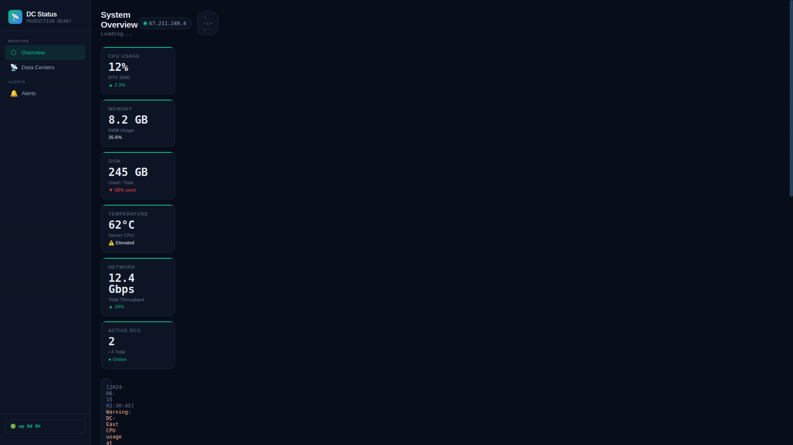

<div align="center">
  
  
  
</div>

<br>

<div align="center">
  <h1>🛡️ ADSentinel</h1>
  <p><strong>Active Directory Domain Controller Monitoring Dashboard</strong></p>
  <p>Real-time visibility into DC health, replication status, and alerting — self-hosted & lightweight</p>
  <p>
    <a href="#-features">Features</a> •
    <a href="#-quick-start">Quick Start</a> •
    <a href="#-architecture">Architecture</a> •
    <a href="#-api">API</a> •
    <a href="#-deployment">Deployment</a>
  </p>
</div>

---

## 📸 Screenshot


*Active Directory Domain Controller monitoring dashboard with health status, replication tracking, and alerting*

## ✨ Features

- **Domain Controller Health Monitoring** — Real-time status of all DCs in your forest
- **Replication Status** — Track replication latency and failures between domain controllers
- **Alerting** — Built-in alerting for DC failures, replication issues, and service outages
- **Public Status Page** — Lightweight public endpoint for "All systems operational" status
- **Mock Mode** — Works offline with mock data for development without live AD connectivity
- **Admin Dashboard** — Detailed private view with full metrics
- **PowerShell Collectors** — Scripts to gather live AD data from Windows Domain Controllers

## 🚀 Quick Start

### Prerequisites
- Python 3.10+
- Flask
- For live data: Windows Server with Active Directory + PowerShell 5.1+

### Installation

```bash
git clone https://github.com/OneByJorah/ADSentinel.git
cd ADSentinel
pip install flask
python3 app.py
```

Open **http://localhost:5000** for the admin dashboard or **http://localhost:5000/public** for the public status page.

## 🏗️ Architecture

```
ADSentinel/
├── app.py                       # Flask web server
├── requirements.txt             # Python dependencies
├── templates/                   # Jinja2 HTML templates
│   ├── dashboard.html           # Admin dashboard
│   └── public.html              # Public status page
├── collectors/                  # AD data collectors (PowerShell)
├── docs/                        # Documentation
├── assets/                      # Static assets
└── mock_dc_status.json          # Mock data for development
```

## 🔧 API

| Endpoint | Method | Description |
|----------|--------|-------------|
| `/` | GET | Admin dashboard with full DC metrics |
| `/public` | GET | Public status page |

## 📡 Data Collection

### PowerShell Collector
Gathers: DC status, replication status, service health, performance counters.

### Mock Data
For development without an Active Directory environment, use `mock_dc_status.json`.

## 🐳 Deployment

```bash
docker build -t adsentinel .
docker run -d -p 5000:5000 adsentinel
```

## 📄 License

MIT © Jhonattan L. Jimenez

---

<div align="center">
  <p>Built with ❤️ for IT operations teams</p>
  <p><a href="https://github.com/OneByJorah">@OneByJorah</a></p>
</div>
