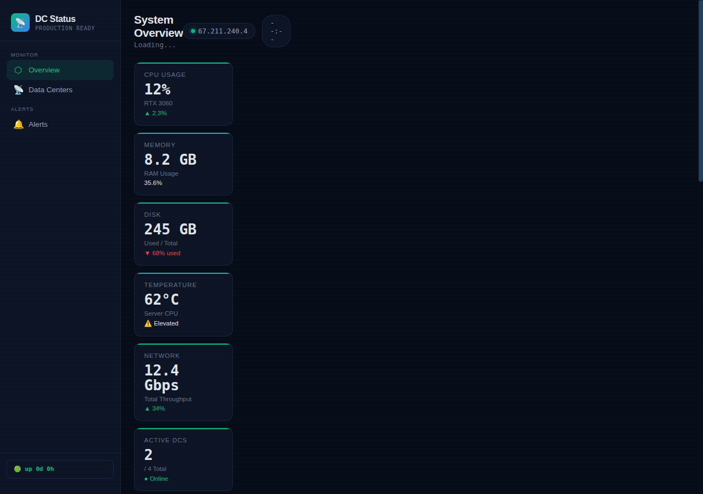

# ADSentinel — Active Directory Monitoring Dashboard

**Version:** v1.0  
**Status:** Active Development  
**Repository:** https://github.com/OneByJorah/ADSentinel

---

## Table of Contents

- [Overview](#overview)
- [Architecture](#architecture)
- [Technology Stack](#technology-stack)
- [Features](#features)
- [Getting Started](#getting-started)
- [Service Management](#service-management)
- [Project Structure](#project-structure)
- [Screenshots](#screenshots)
- [Contributing](#contributing)
- [License](#license)
- [Author](#author)

---

## Overview

ADSentinel is an Active Directory monitoring dashboard focused on health checks, replication status, and alerting. It provides a web-based view into domain controller state and includes mock/test collectors for environments where live DC connectivity isn’t available.

Targets Windows-based AD environments with PowerShell collectors, and renders a responsive HTML dashboard.

---

## Architecture

Client → Flask backend (`app.py`) → collectors (PowerShell/Mock JSON) → templates (`dashboard.html`, `public.html`) → browser UI.

Data paths:
- Mock collector: `mock_dc_status.json`
- Templates: `templates/dashboard.html`, `templates/public.html`
- Assets: `assets/screenshot.png`

---

## Technology Stack

| Layer | Stack |
|---|---|
| Runtime | Linux/Windows (PowerShell collectors) |
| Backend | Python / Flask |
| Collectors | PowerShell 5.1+ |
| Frontend | HTML5 (Jinja2 templates) |
| VCS | Git + GitHub (`github.com/OneByJorah/ADSentinel`) |

---

## Features

- **DC health monitoring**: domain controller status and replication checks.
- **Alerting**: notifications via collector logic.
- **Mock/test mode**: uses `mock_dc_status.json` for offline development.
- **Responsive dashboard**: public and private (admin) views.
- **Lightweight**: Flask + SQLite-style JSON state, easy to self-host.

---

## Getting Started

```bash
# 1. Clone the repository
git clone https://github.com/OneByJorah/ADSentinel.git
cd ADSentinel

# 2. Install dependencies
pip install -r requirements.txt

# 3. Run the app
python3 app.py
```

Visit `http://localhost:5000`.

Health check: `http://localhost:5000/health`

> Note: PowerShell collectors are intended for Windows hosts. On Linux, use the mock data path for UI development.

---

## Service Management

```bash
# Example systemd unit location: systemd/pirouter.service (adapt for app.py)
# For quick testing without systemd, run:
python3 app.py
```

---

## Project Structure

```
ADSentinel/
├── app.py
├── requirements.txt
├── init_db.py
├── start.sh
├── collectors/
│   ├── ldap_service.ps1
│   ├── mock_dc_collector.ps1
│   └── notifications.ps1
├── templates/
│   ├── dashboard.html
│   └── public.html
├── assets/
│   └── screenshot.png
├── docs/
│   ├── GITHUB_STEPS.txt
│   └── ROADMAP.md
└── systemd/
```

---

## Screenshots

### ADSentinel Dashboard


---

## Contributing

1. Create a feature branch off `main`.
2. Test mock mode locally before submitting collector changes.
3. Submit a PR with description and screenshots for UI changes.

---

## License

MIT

---

## Author

Built by **Jhonattan L. Jimenez**.
