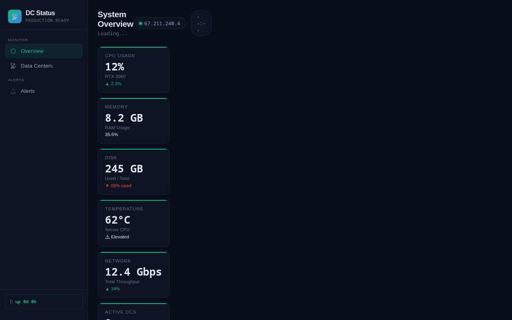

<div align="center">


# DirWatch

Active Directory DC monitoring dashboard


</div>

---

<p align="center">
  
</p>

<br>

---

## Features

- **Real-Time Monitoring** — Live health metrics for all domain controllers.
- **Replication Status** — Track AD replication between DCs.
- **Alert System** — Configurable alerts for DC health issues.
- **LDAP Integration** — Direct LDAP queries to Active Directory.
- **Historical Data** — Track health trends over time.
- **Flask Dashboard** — Lightweight Python web interface.
- **Docker Support** — Easy deployment with Docker.

## Quick Start

```bash
git clone https://github.com/OneByJorah/DirWatch.git
cd DirWatch

pip install -r requirements.txt
python3 app.py
```

Open **http://localhost:5000** in your browser.

### Docker

```bash
docker compose up -d
```

## Configuration

| Variable | Default | Description |
|----------|---------|-------------|
| `LDAP_SERVER` | — | Domain controller hostname |
| `LDAP_BASE_DN` | — | Base DN for queries |
| `LDAP_BIND_DN` | — | Bind DN for authentication |
| `LDAP_PASSWORD` | — | LDAP password |
| `ALERT_EMAIL` | — | Email for alerts |
| `REFRESH_INTERVAL` | `60` | Monitoring refresh interval (seconds) |

## Architecture

```
Browser ──HTTP──▶ Flask App ──LDAP──▶ Active Directory
                    │
                    ├──▶ Health Monitor
                    ├──▶ Replication Checker
                    ├──▶ Alert Engine
                    └──▶ SQLite (Historical Data)
```

## Project Structure

```
DirWatch/
├── app.py                 # Flask application
├── monitor/
│   ├── __init__.py
│   ├── health.py          # DC health monitoring
│   ├── replication.py     # Replication status
│   └── alerts.py          # Alert management
├── templates/             # HTML templates
├── static/                # CSS, JS
├── requirements.txt       # Python dependencies
├── docker-compose.yml     # Docker deployment
└── README.md
```

## Dashboard Panels

| Panel | Description |
|-------|-------------|
| **DC Overview** | Status of all domain controllers |
| **Replication** | Inter-DC replication health |
| **FSMO Roles** | FSMO role holder status |
| **Events** | Recent AD events and errors |
| **Trends** | Historical health metrics |

## Contributing

Contributions are welcome. Please see [CONTRIBUTING.md](CONTRIBUTING.md) for guidelines and [CODE_OF_CONDUCT.md](CODE_OF_CONDUCT.md) for community standards.

## Security

For security concerns, see [SECURITY.md](SECURITY.md). Please report vulnerabilities to **info@jorahone.com** — do not use public issues.

## License

MIT © Jhonattan L. Jimenez

---

## 🤝 Contributing

See [CONTRIBUTING.md](CONTRIBUTING.md). All contributions follow the [Code of Conduct](CODE_OF_CONDUCT.md).

## 🔒 Security

Found a vulnerability? Please follow our [Security Policy](SECURITY.md) and report privately to `security@jorahone.com`.

## 📄 License

[MIT License](LICENSE) © Jhonattan L. Jimenez (OneByJorah)

---

<p align="center">Built with 🌴 by <a href="https://github.com/OneByJorah">OneByJorah</a> · <a href="https://jorahone.com">jorahone.com</a></p>
